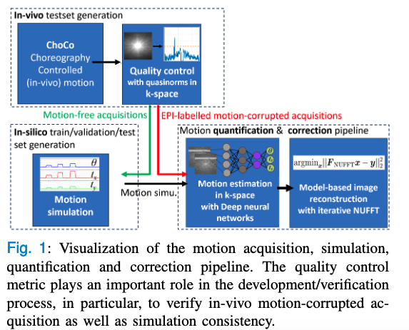

# SISMIK for brain MRI: Deep-learning-based  motion estimation and model-based motion  correction in k-space

A retrospective method for motion estimation and correction to tackle the problem of in-plane rigid-body motion, apt for classical 2D Spin-Echo scans of the brain, which are regularly used in clinical practice.

Note: TSE is in Cartesian space...
If it is combined with the FID signal, it would also estimate the rotation and translation shift?

