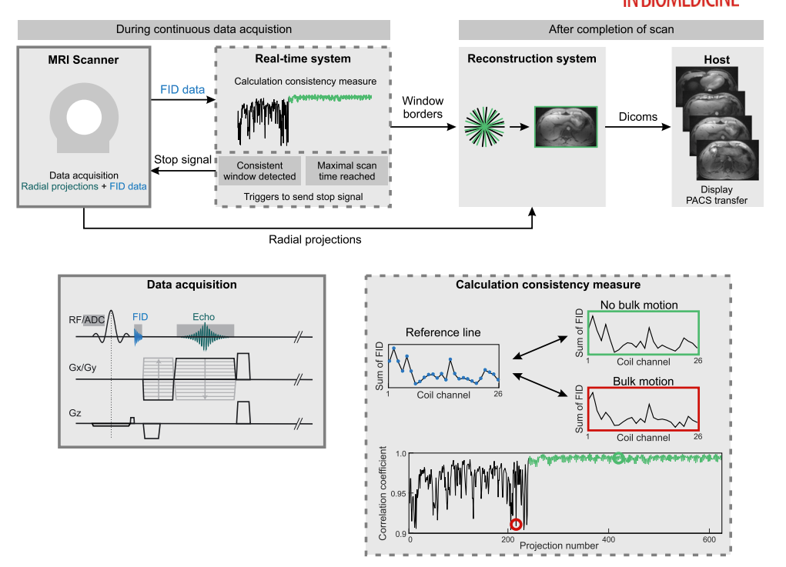
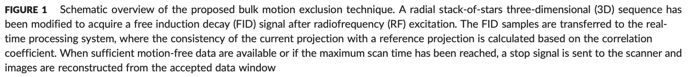
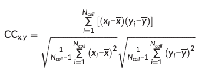
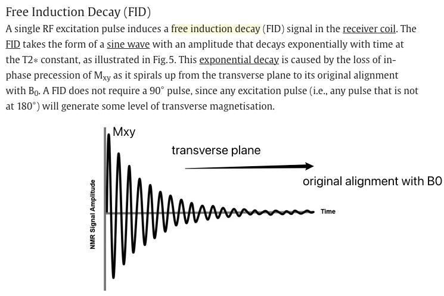
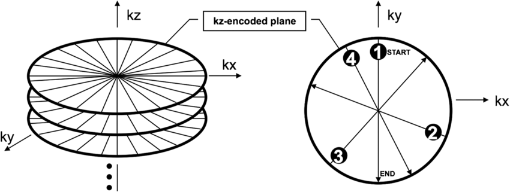

## Paper link

[https://pmc.ncbi.nlm.nih.gov/articles/PMC5643254/pdf/NBM-30-na.pdf](https://pmc.ncbi.nlm.nih.gov/articles/PMC5643254/pdf/NBM-30-na.pdf)

## Extraction from the paper

- Bulk motion
    
    - in the presence of bulk patient motion (i.e. voluntary or involuntary patient movement resulting in translation, rotation or elastic deformations of the body).

- Gaps/difficulties:
    
    - these techniques for respiration cannot correct for bulk motion
        
        - which includes voluntary and involuntary patient movement resulting in translation, rotation or elastic deformation of the body.3
    - One possibility to remove bulk motion is to exclude corrupted data retrospectively.
        
        - Because the duration and number of intervals with bulk motion is not known in advance, k‐space must be acquired with significant oversampling to provide sufficient k‐space coverage. This prolongs the scan time unnecessarily if no (or only short) intervals of bulk motion occur, or results in residual undersampling artifacts if more bulk motion than expected occurs.
- Limitations:
    
    - reject data by bulk motion but does not compensate for respiratory motion -> need second processing step.
        
- Method
    
    - Data‐consistency‐driven image stabilization technique that detects and excludes bulk movements during data acquisition.
    - Data corrupted by bulk motion were successfully detected and excluded from image reconstruction
    - An overall increase in image sharpness and reduction of streaking and shine‐through artifacts were seen in the volunteer study, as well as in the neck and knee scans.
    - The proposed technique enables automatic real‐time detection and exclusion of bulk motion during MR examinations without user interaction.
    - the technique automatically detects motion‐free data windows and stops the scan if a window with sufficient length has been identified.
- What sequence
    
    - a T1‐weighted radial 3D gradient‐echo sequence with both RF and gradient spoiling.
    - The stack‐of‐stars scheme with Cartesian encoding along the kz dimension and radial sampling in the kx–ky plane is used for volumetric k‐space coverage.
    - To obtain motion information, 32 samples of the FID signal are acquired after rewinding the slice selection gradient, which increases the TE by less than 0.5 ms.
    - The FID approach is used in this work to derive a motion signal. It has been shown previously that variations in the signal intensity ratio between different receive coils allow the identification of bulk motion.
    - There are two alternative self-navigation techs:
        
        - non-phase-encoded k-space center lines->for stack-of-stars sequence, non-Cartesian 3D trajectories good -> for Cartesian 3D sampling it requires the acquisition of additional non-phase-encoded k-space lines, which prolongs the scan time.
        - Free induction decay navigators: sample the center of k-space without spatial encoding  immediately after the RF excitation -> selected

- 32 samples of FID signals -> image calculation environment(ICE) framework -> detection of bulk motion.
    
    - The first and last four samples of each FID signal are discarded to account for pre‐ and post‐ringing.
        
        - For ach projection, the summed values from the different coils are concatenated into a projection vector of length Ncoil.
        - Motion is detected by calculating the correlation coefficient between a reference projection vector and all other projection vectors.
            
            
            
            - A low correlation coefficient implies that the load distribution of the coil elements has changed. This indicates that the patient position has been altered between the projections.
    - Calculate the reference projection vector, which is defined as the projection with highest overall correlation to all previously acquired projections, is dynamically updated after each projection.
        
        - In the current implementation, the reference projection is therefore only calculated within a sliding window containing the previous 100 projections.
        - Outlier projections, which indicate bulk motion, are identified using a user‐defined acceptance threshold for the correlation coefficient.
- Details during imaging
    
    - a scan without bulk motion was performed as reference.
    - max scan time: 5min11s -- 1500 projections
    - the acceptance window was set to 400 projections (1min23s) --  fulfill Nyquist criterion for radial sampling (??)

## Information about FID signal

### FID signals

[https://www.sciencedirect.com/topics/neuroscience/free-induction-decay#:~:text=Free%20Induction%20Decay%20(FID)%20refers,its%20original%20alignment%20with%20B0.](https://www.sciencedirect.com/topics/neuroscience/free-induction-decay#:~:text=Free%20Induction%20Decay%20(FID)%20refers,its%20original%20alignment%20with%20B0.)

- When an [RF pulse](https://www.sciencedirect.com/topics/neuroscience/radiofrequency-pulse "Learn more about RF pulse from ScienceDirect's AI-generated Topic Pages") is turned off, protons begin to lose phase coherence, resulting in an exponential decrease of the signal intensity to zero. This signal decay is called free induction decay (FID) (Currie et al., 2013).
- FID signal has a resonant frequency, which takes the form of a sine wave, which is at its highest immediately after the RF pulse is switched off and decreases as relaxation occurs.
- An RF pulse at any flip angle can create an FID because some protons in longitudinal magnetization are tipped into transverse magnetization. 

### How to extract the FID from raw data

### 1\. Understand the Acquisition Setup

- FID signals are collected before the imaging gradients are fully applied.
    
    - The FID contains information about the global magnetization state of the tissue but has no spatial encoding yet.
    
- In radial stack-of-star sequences, the FID signal corresponds to data at or near the k-space center, typically sampled immediately after the RF pulse.
    
    - why
- The FID signal is generated **immediately** after the RF excitation pulse, as soon as the spins start precessing.
- The gradients needed for spatial encoding are typically applied **after the FID starts**. This delay is necessary because:
    
    - The RF pulse and gradients require separate timing to avoid interference.
    - Applying gradients during the RF pulse or immediately afterward can distort the FID and reduce signal quality.
- The **initial part of the signal**, acquired before the gradients are active, represents the "pure" FID—this is the part you extract for motion detection or other analyses.

**2\. Identify the FID Portion in Raw Data**

- The FID is typically acquired as the initial part of each readout, before gradients start encoding spatial information.

### 3\. Extract k-Space Center

- The FID signal corresponds to the low spatial frequency (k-space center) information. You can identify this by:
    
    - **Temporal Location:** Extract data samples immediately after the RF pulse and before the imaging gradients are active.

### 4\. FID in the Context of a Stack-of-Star Sequence

- In radial sequences like stack-of-stars, k-space is sampled using radial trajectories starting at the center.
- At the start of each radial spoke, the k-space center is sampled, and this corresponds to the **initial FID signal**.
- Because the gradients are weak or inactive near the k-space center, the early signal is dominated by the FID, with minimal spatial encoding effects.

### 5\. How Motion Affects the FID

Motion impacts the FID signal in the following ways:

**a. Phase Changes Due to Motion**

- Motion alters the relative positions of spins in the magnetic field, which changes their precession phase.
- These phase changes are global (affecting the whole signal) and become apparent in the FID because the FID is the earliest signal captured after excitation.
- For example, a small head movement during the acquisition will introduce phase shifts, which can be detected in the FID signal.

**b. Amplitude Modulation**

- Motion can cause signal dephasing, where spins lose coherence due to changing positions or velocities. This results in a reduced FID amplitude.
- Additionally, periodic motions (e.g., respiratory or cardiac motion) may modulate the FID signal amplitude in a predictable way.

**c. Frequency Shifts**

- If the motion involves velocity (e.g., blood flow or respiratory motion), it can introduce frequency shifts due to the Doppler effect. These shifts can also be detected in the FID.

## Information about stack-of-star sequence

[https://www.researchgate.net/figure/Illustration-of-3D-k-space-stack-of-stars-trajectory-for-RAVE-Along-the-slice_fig1_330526199](https://www.researchgate.net/figure/Illustration-of-3D-k-space-stack-of-stars-trajectory-for-RAVE-Along-the-slice_fig1_330526199)

Illustration

But it does not start from the k-space center?

Here is the described sequence:

- Data are acquired using a T1‐weighted radial 3D gradient‐echo sequence with both RF and gradient spoiling [https://mriquestions.com/spoiling---what-and-how.html#/](https://mriquestions.com/spoiling---what-and-how.html#/)
- The stack‐of‐stars scheme with Cartesian encoding along the kz dimension and radial sampling in the kx–ky plane is used for volumetric k‐space coverage.
- After spectral fat suppression using a chemical shift selective (CHESS) pulse, all partitions for one radial angle are acquired with centric reordering before the readout scheme is repeated for subsequent radial projections.
- Golden‐angle ordering with an angular increment of 111.246°25 is used for continuous data acquisition.